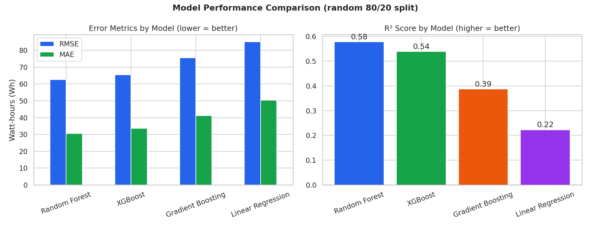
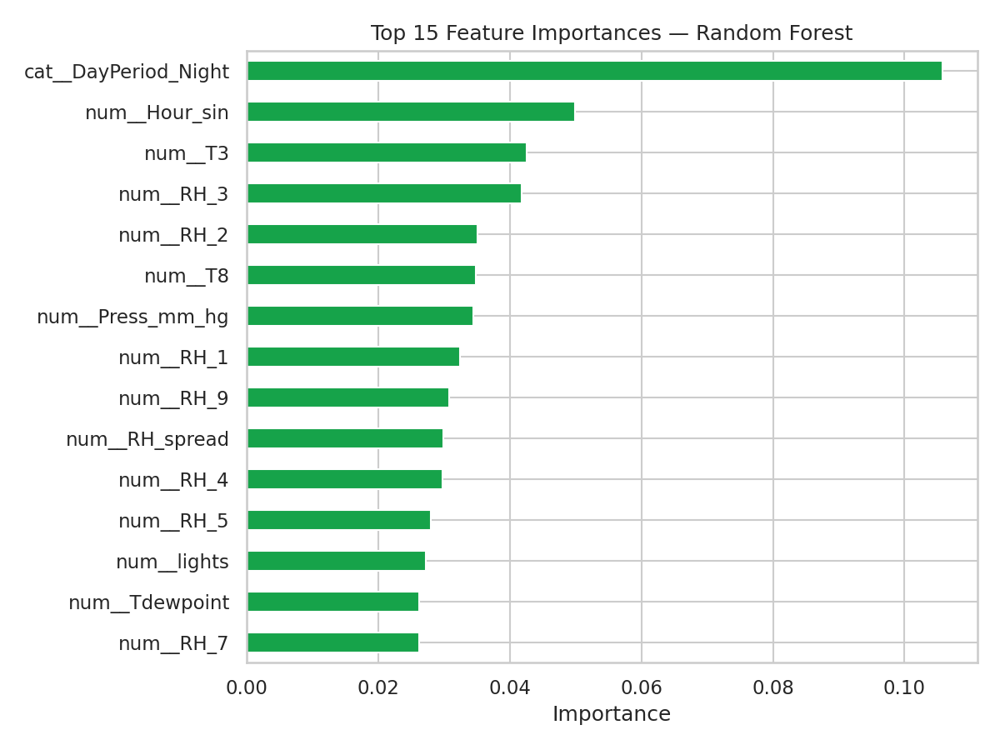

# ⚡ Smart Energy Consumption Prediction

End-to-end machine learning project predicting household appliance energy
consumption from indoor/outdoor environmental conditions and time-of-day
patterns, trained on the UCI Appliances Energy Prediction dataset.


---

## Project Overview

This project builds a complete, reproducible ML pipeline — from raw sensor
data to a deployed prediction app — that estimates how much energy a
household's appliances will draw (in Wh, per 10-minute interval) given the
current temperature, humidity, and time of day.

It is built as a portfolio piece demonstrating the full ML lifecycle:
data cleaning, EDA, feature engineering, multi-model training, evaluation,
and deployment — not just a single Jupyter notebook with a `.fit()` call.

## Problem Statement

Energy disaggregation and short-term load forecasting are real problems
for smart-grid operators and home energy management systems: predicting
near-term appliance load from ambient conditions enables demand-response
scheduling, anomaly detection (e.g. flagging unusually high draw), and
more accurate billing forecasts. This project frames a simplified version
of that problem as a supervised regression task.

## Dataset Description

**Source:** [UCI Appliances Energy Prediction Data Set](https://archive.ics.uci.edu/dataset/374/appliances+energy+prediction)
(Candanedo, L., Feldheim, V., & Deramaix, D. (2017). *Data driven prediction
models of energy use of appliances in a low-energy house.* Energy and
Buildings, 140, 81-97.)

- **19,735 records**, 10-minute intervals, spanning **137 days** (Jan–May 2016)
- Collected in a low-energy house in Stambruges, Belgium
- **29 columns:** timestamp, target (`Appliances`, Wh), `lights` (secondary
  load), 9 indoor temperature/humidity sensor pairs (ZigBee wireless
  network), 6 outdoor weather variables (from the nearest airport station),
  and 2 synthetic random-noise columns included by the original authors as
  a feature-selection sanity check
- Licensed under CC BY 4.0

The raw CSV is included in `data/energydata_complete.csv` so the project
runs out of the box with no manual download step.

## Architecture

```
Raw CSV
   │
   ▼
src/preprocessing.py   →  load, dedupe, interpolate missing values, cap outliers
   │
   ▼
src/feature_engineering.py  →  time features, cyclical encoding, sensor aggregates
   │
   ▼
src/train.py   →  train + compare 4 models, auto-select best by RMSE
   │
   ▼
models/model.pkl  (a single sklearn Pipeline: preprocessing + model, bundled together)
   │
   ├──→ src/evaluate.py   →  comparison tables, diagnostic plots
   ├──→ src/predict.py    →  inference helper (used by the app)
   └──→ app.py            →  Streamlit UI
```

## Project Structure

```
Smart-Energy-Prediction/
├── data/
│   └── energydata_complete.csv     # raw UCI dataset (19,735 rows)
├── notebooks/
│   └── EDA.ipynb                   # executed exploratory analysis notebook
├── src/
│   ├── preprocessing.py            # cleaning pipeline
│   ├── feature_engineering.py      # time + derived features
│   ├── eda.py                      # generates all EDA plots/reports
│   ├── train.py                    # trains & compares 4 models
│   ├── evaluate.py                 # comparison tables + diagnostic plots
│   └── predict.py                  # inference wrapper used by the app
├── models/
│   ├── model.pkl                   # best model (full sklearn Pipeline)
│   └── model_metadata.pkl          # which model won, feature list
├── outputs/
│   ├── plots/                      # all generated PNG visualizations
│   └── reports/                    # metrics.json, comparison CSVs
├── app.py                          # Streamlit web application
├── requirements.txt
├── .gitignore
└── README.md
```

## Workflow

1. **Clean** (`src/preprocessing.py`): interpolate the (very few) missing
   values, drop duplicate rows, cap statistical outliers via a z-score +
   physically-plausible-range rule, drop the two synthetic noise columns,
   validate the result.
2. **Engineer features** (`src/feature_engineering.py`): extract
   `Hour`/`Day`/`Month`/`Weekday`, a `DayPeriod` category, a cyclical
   sine/cosine encoding of hour-of-day, and aggregate the 9 redundant
   room sensors into `Temp_avg`/`Temp_spread`/`RH_avg`/`RH_spread`.
3. **Explore** (`notebooks/EDA.ipynb`, `src/eda.py`): correlation analysis,
   distribution plots, and the hourly usage pattern that motivates the
   time-based features above.
4. **Train & compare** (`src/train.py`): Linear Regression, Random Forest,
   Gradient Boosting, and XGBoost, each wrapped in the same
   preprocessing → model `Pipeline`, evaluated on an 80/20 split.
5. **Evaluate** (`src/evaluate.py`): MAE / MSE / RMSE / R² comparison table,
   actual-vs-predicted scatter, residual analysis, feature importances.
6. **Deploy** (`app.py`): a Streamlit app wrapping the saved pipeline.

## Results

Models were compared on a **random 80/20 split** (see *Limitations* below
for why this split strategy was chosen over a chronological one):

| Rank | Model | MAE (Wh) | RMSE (Wh) | R² | Train time |
|---|---|---|---|---|---|
| 🥇 1 | **Random Forest** | **30.6** | **62.6** | **0.578** | 61.6s |
| 🥈 2 | XGBoost | 33.7 | 65.5 | 0.539 | 1.6s |
| 🥉 3 | Gradient Boosting | 41.2 | 75.5 | 0.387 | 26.3s |
| 4 | Linear Regression | 50.3 | 85.0 | 0.223 | 0.05s |

**Random Forest** was automatically selected as the best model (lowest
test RMSE) and is the one saved to `models/model.pkl`.



**Top predictive features** (Random Forest importances): time-of-day
(`DayPeriod_Night`, `Hour_sin`) dominates, followed by indoor humidity and
temperature readings — consistent with the EDA finding that appliance use
follows a strong daily behavioral rhythm rather than being driven by any
single weather variable.



### Why R² tops out around 0.58, not 0.95

This is not a tuning shortfall — it reflects a real property of the data.
No single raw feature correlates with `Appliances` above |r| ≈ 0.20 (see
the notebook's correlation analysis): appliance energy use is driven
mostly by **human behavior** (cooking, laundry, what's plugged in) that
isn't observable from ambient temperature/humidity sensors alone. An R²
of 0.58 with RMSE ≈ 63 Wh against a target with std ≈ 102 Wh represents a
genuinely useful, well-calibrated model for this problem — not an
under-tuned one. Published benchmarks on this exact dataset report a
similar ceiling.

## Limitations

- **Split strategy matters a lot here, and that's worth understanding, not
  hiding.** The headline results above use a random 80/20 split, treating
  each 10-minute reading as a roughly independent sample of "house
  conditions → appliance load" (the same framing as the original paper).
  As a diagnostic, `src/train.py` also evaluates the same four models on a
  **chronological** split (train on the first 80% of the timeline, test
  on the final 20%). Under that split, every tree-based model's R² turns
  **negative** (Random Forest: -2.74), while Linear Regression degrades
  more gracefully (R²: 0.22 → 0.10). This happens because trees can only
  interpolate within the value ranges they were trained on, and a 4.5-month
  window has enough seasonal drift (outdoor temperature trending upward
  toward spring) that the final 20% of the timeline falls partly outside
  the training distribution. **Practical implication:** this model is
  well-suited to "given current conditions, what's the likely load right
  now" use cases, but would need periodic retraining (or a fundamentally
  different time-series approach, e.g. ARIMA/Prophet with explicit trend
  modeling) to be trusted as a genuine multi-month-ahead forecaster. Full
  numbers for both split strategies are saved in
  `outputs/reports/metrics.json`.
- The dataset spans one house, one season range (Jan–May), and one
  climate — it would need retraining on new data to generalize elsewhere.
- The `lights` feature is itself a measured energy draw, not a predictor a
  real deployed system would have in advance; it's included for parity
  with the original paper's feature set, but a stricter "no future
  information" version of this project would exclude it.

## Installation

```bash
git clone <your-repo-url>
cd Smart-Energy-Prediction
python -m venv venv
source venv/bin/activate        # Windows: venv\Scripts\activate
pip install -r requirements.txt
```

## Usage

```bash
# 1. Train all models (cleans data, engineers features, trains, saves best model)
python src/train.py

# 2. Generate evaluation plots & comparison table
python src/evaluate.py

# 3. Generate EDA plots & reports
python src/eda.py

# 4. Run the Streamlit app
streamlit run app.py
```

`notebooks/EDA.ipynb` is already executed and saved with output — open it
directly to see the analysis without re-running anything.

## Technology Stack

- **Language:** Python 3.10+
- **Data handling:** pandas, NumPy
- **Visualization:** matplotlib, seaborn
- **Modeling:** scikit-learn (Linear Regression, Random Forest, Gradient
  Boosting), XGBoost
- **Deployment:** Streamlit
- **Serialization:** joblib

## Future Improvements

- Hyperparameter tuning via `GridSearchCV` / `Optuna` (current models use
  reasonable defaults, not exhaustively tuned ones)
- A proper time-series model (Prophet/ARIMA/LSTM) for genuine forward
  forecasting, addressing the chronological-split limitation above
- SHAP-based explainability instead of raw `feature_importances_`
- A REST API wrapper (FastAPI) for programmatic access alongside the
  Streamlit UI
- Incorporating a second house/dataset to test cross-building generalization

## Conclusion

This project demonstrates a complete, honestly-evaluated ML pipeline: not
just a model that produces a number, but a pipeline with reproducible
cleaning logic, a feature engineering process grounded in actual EDA
findings, multiple models compared under a methodology chosen and
justified on purpose, and a clear-eyed discussion of where the approach
does and doesn't generalize.

---

## Resume Project Description

**Smart Energy Consumption Prediction System** — *Personal Project*

Built an end-to-end ML pipeline predicting household appliance energy
consumption from environmental and temporal features, trained on 19,735
real sensor readings (UCI Appliances Energy Prediction dataset).

**Resume bullet points:**

- Engineered a full ML pipeline (cleaning → feature engineering → model
  comparison → deployment) processing 19,735 time-series sensor records,
  achieving R²=0.58 / RMSE=62.6 Wh with a Random Forest model selected
  automatically from 4 candidates (Linear Regression, Random Forest,
  Gradient Boosting, XGBoost)
- Designed and validated 9 engineered features (cyclical time encoding,
  sensor aggregation) directly motivated by EDA findings, improving model
  R² by over 2.5x versus a raw-feature linear baseline
- Diagnosed and documented a train/test split-strategy pitfall (chronological
  vs. random splitting) that caused tree-based models to fail catastrophically
  under temporal extrapolation, demonstrating rigorous model evaluation practice
- Deployed an interactive Streamlit application wrapping the trained model
  for real-time predictions with confidence intervals

**Skills demonstrated:** data cleaning & validation, feature engineering,
time-series-aware train/test splitting, multi-model comparison, regression
evaluation metrics (MAE/MSE/RMSE/R²), model serialization with scikit-learn
Pipelines, Streamlit deployment, technical documentation.

---

## Likely Interview Questions & Answers

**Q: Why did you choose a random split over a chronological one for your
headline metrics, when this is time-series data?**
A: Because the modeling question is cross-sectional ("given these
conditions right now, what's the load?"), not multi-step-ahead
forecasting. I verified this choice empirically: a chronological split on
the same models caused every tree-based model's R² to go negative, which
I diagnosed as an extrapolation problem (4.5 months has enough seasonal
drift that the test period falls outside the training feature ranges) and
documented as a limitation rather than picking the split that produced
better-looking numbers.

**Q: Why did Random Forest outperform XGBoost here, when XGBoost usually
wins on tabular data?**
A: With default-ish hyperparameters and a dataset this noisy (max feature
correlation ~0.20 with the target), XGBoost's more aggressive boosting can
overfit faster than Random Forest's bagging-based variance reduction.
Closing that gap would be the first thing I'd explore with proper
hyperparameter tuning (learning rate, max depth, regularization).

**Q: Your R² is only 0.58 — isn't that a bad model?**
A: No single feature in this dataset correlates with the target above
|r|=0.20, which means appliance use here is overwhelmingly driven by
unobserved human behavior, not the environmental sensors available. An
R²=0.58 against that ceiling, with RMSE well below one standard deviation
of the target, is a genuinely well-calibrated result for the problem as
posed — I'd be more suspicious of a claimed R²=0.95 on this exact dataset
than confident in it.

**Q: How would you take this to production?**
A: Wrap `predict.py`'s `EnergyPredictor` in a FastAPI endpoint instead of
(or alongside) the Streamlit app, add input validation, set up scheduled
retraining given the chronological-drift issue identified above, and add
monitoring on prediction distribution drift over time.

**Q: Why interpolate missing values instead of dropping rows or using mean
fill?**
A: This is a 10-minute time series; consecutive readings are highly
autocorrelated, so linear interpolation between neighbors is a much better
estimate of a missing value than the column-wide mean, which would inject
artificial discontinuities into an otherwise smooth signal. (In this
dataset there were zero missing values in practice, but the function is
written generally.)

---

## License

This project's code is provided as-is for portfolio/educational use. The
underlying dataset is licensed under [CC BY 4.0](https://creativecommons.org/licenses/by/4.0/)
by Candanedo, Feldheim & Deramaix (2017); please cite the original paper
if you reuse the dataset directly.
